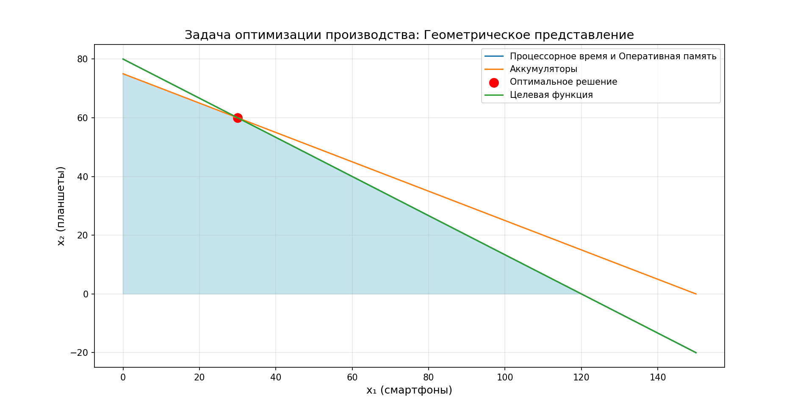
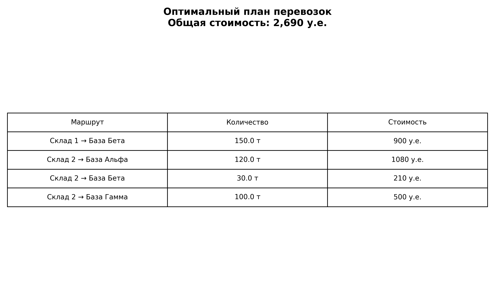

Выполнила Васильева Е.Д.,  группа 2.1, 04.01.2026
# Теоретическая часть:
## Основные понятия ЛП
•	Целевая функция: Линейная функция для максимизации/минимизации
•	Ограничения: Линейные равенства/неравенства
•	Условия: xj≥0xj≥0
### 2. Классические методы решения
2.1. Симплекс-метод 
•	Принцип: Перебор вершин многогранника
•	Плюсы: Прост в реализации, хорош для малых задач
•	Минусы: Экспоненциальная сложность в худшем случае
2.2. Методы внутренней точки 
•	Принцип: Движение через внутренность области
•	Плюсы: Полиномиальная сложность, эффективен для больших задач
•	Минусы: Сложная реализация
3. Решение в Python 
python
from scipy.optimize import linprog
result = linprog(c, A_ub=A_ub, b_ub=b_ub, 
                 A_eq=A_eq, b_eq=b_eq,
                 bounds=bounds, method='highs')
## Методы: 'highs' (по умолчанию), 'simplex', 'interior-point'
4. Условия оптимальности (KKT)
1.	Стационарность: ∇L=0∇L=0
2.	Допустимость: Удовлетворение ограничениям
3.	Двойственная допустимость: μi≥0μi≥0
5. Экономический смысл
•	Множители Лагранжа = теневые цены ресурсов
•	Показывают ценность дополнительной единицы ресурса
6. Особые случаи
•	Транспортная задача: Частный случай ЛП
•	Сбалансированность: ∑∑ запасы = ∑∑ потребности
•	Анализ чувствительности: Как меняется решение при изменении параметров
7. Практическое применение
•	Производство: Оптимизация выпуска продукции
•	Транспорт: Минимизация логистических затрат
•	Финансы: Оптимизация инвестиций
•	Военное дело: Планирование снабжения

# Решение Задачи 1:
## 1.1 Математическая модель
a) x_1 -- кол-во смартфонов за месяц, x_2 -- кол-во планшетов за месяц
b) Максимизируем общую прибыль, т.е. P(x_1,x_2)=8000*x_1+12000*x_2 --> max
c)

| Ресурс | Ограничение |
|----------|----------|
|Процессорное время | 2*x_1 + 3*x_2<=240 |
|Оперативная память|4*x_1 + 6*x_2<=480|
|Аккумуляторы|x_1 + x_2 <= 150|
|Неотрицательность|x_1>=0, x_2>=0|

## 1.2 Построение функции Лагранжа
a) Z(x_1,x_2)= -8000*x_1 - 12000*x_2

| Ресурс | Ограничение |
|----------|----------|
|Процессорное время | g_1(x) = 2*x_1 + 3*x_2 - 240 <= 0 |
|Оперативная память| g_2(x) = 4*x_1 + 6*x_2 - 480 <= 0|
|Аккумуляторы| g_3(x) = x_1 + x_2 - 150 <= 0|
|Неотрицательность| g_4(x) = -x_1 <= 0, g_5(x) = -x_2 <= 0|

Каноническая форма задачи: 
- Z = -8000*x_1 - 12000*x_2 --> min
- g_1(x) = 2*x_1 + 3*x_2 - 240 <= 0
- g_2(x) = 4*x_1 + 6*x_2 - 480 <= 0
- g_3(x) = x_1 + x_2 - 150 <= 0
- g_4(x) = -x_1 <= 0
- g_5(x) = -x_2 <= 0

b) u_1, u_2, u_3, u_4, u_5 >= 0
L(x, u) = -8000*x_1 - 12000*x_2 + u_1*(2*x_1 + 3*x_2 - 240) + u_2*(4*x_1 + 6*x_2 - 480) + u_3*(x_1 + x_2 - 150) + u_4*(-x_1) + u_5*(-x_2)
c)
- Множители Лагранжа показывают, на сколько изменится оптимальное значение целевой функции при увеличении запаса ресурса на 1 единицу;
- u_1 - процессорное время, экономический смысл - прирост максимальной прибыли при увеличении доступного процессорного времени на 1 час;
- u_2 - оперативная память, экономический смысл - прирост максимальной прибыли при увеличении объёма оперативной памяти на 1 ГБ;
- u_3 - аккумуляторы, экономический смысл - дополнительная прибыль при наличии одного дополнительного аккумулятора;
- u_4, u_5 - неотрицательность переменных, не имеют экономической интерпретации;

Общая интерпретация:
- u_i > 0 --> ресур полностью используется и является ограничивающим;
- u_i = 0 --> ресурс имеется в избытке;

## 1.3 Код
```Python
import numpy as np
from scipy.optimize import linprog
import matplotlib.pyplot as plt


# Целевая функция (для максимизации прибыли нужно минимизировать -P)
c = [-8000, -12000]

# Ограничения-неравенства A_ub @ x <= b_ub
A_ub = [
    [2, 3],
    [4, 6],
    [1, 2]
]
b_ub = [240, 480, 150]

# Границы переменных
bounds = [(0, None), (0, None)]

# Решение задачи
result = linprog(c, A_ub=A_ub, b_ub=b_ub, bounds=bounds, method='highs')

# Вывод результатов
print("=== Задача оптимизации производства электроники ===")
print(f"Статус: {result.message}")

print(f"Оптимальное количество смартфонов: {result.x[0]}")
print(f"Оптимальное количество планшетов: {result.x[1]}")
print(f"Максимальная прибыль: {-result.fun}")
```
 ## 1.4 Визаулизация
 ```Python
# Визуализация
fig, ax = plt.subplots(figsize=(10, 8))

# Диапазон значений
x1 = np.linspace(0, 150, 400)

# Границы ограничений
x2_constraint1 = (240 - 2*x1) / 3
x2_constraint3 = (150 - x1) / 2

# Построение прямых ограничений
ax.plot(x1, x2_constraint1, label='Процессорное время и Оперативная память')
ax.plot(x1, x2_constraint3, label='Аккумуляторы')

# Закрашивание допустимой области
vertices = np.array([
    [0, 0],
    [120, 0],
    [30, 60],
    [0, 75]
])

polygon = plt.Polygon(vertices, color='lightblue', alpha=0.7)
ax.add_patch(polygon)

# Оптимальная точка
ax.scatter(result.x[0], result.x[1], color='red', marker='o', s=100, label='Оптимальное решение')

# Линии уровня целевой функции
C = -result.fun  # максимальная прибыль
x2 = (C - 8000*x1) / 12000
ax.plot(x1, x2, label='Целевая функция')


ax.set_xlabel('x₁ (смартфоны)', fontsize=12)
ax.set_ylabel('x₂ (планшеты)', fontsize=12)
ax.set_title('Задача оптимизации производства: Геометрическое представление', fontsize=14)
ax.legend()
ax.grid(True, alpha=0.3)
plt.show()
 ```


## 1.5 Анализ результатов
a) Смартфонов 30 штук, планшетов 60 штук, максимальная прибыль 960000 рублей
b)
- Процессорное время: 240 часов, то есть ограничение активное
- Оперативная память: 480 Гб, то есть ограничение активное
- Аккумуляторы: 150 штук, то есть ограничение активное

Все ключевые ресурсы используются. 
c) При увеличении запаса процессорного времени на 10 часов оптимальный план производства и максимальная прибыль не изменяются и остаются равными 960 000 рублей. Это означает, что процессорное время не является дефицитным ресурсом, а его множитель Лагранжа равен нулю. 
Наиболее дефицитными ресурсами являются аккумуляторы и оперативная память, так как именно они ограничивают рост прибыли.

# Решение Задачи 2:
1.1 Мат. модель
Переменные:
х11 - со Склада 1 на Базу Альфа
х12 - со Склада 1 на Базу Бета
х13 - со Склада 1 на Базу Гамма
х21 - со Склада 2 на Базу Альфа
х22 - со Склада 2 на Базу Бета
х23 - со Склада 2 на Базу Гамма

Целевая функция:  Z=8*x_11+6*x_12 + 10 *x_13 + 9*x_21 +7*x_22 +5*x_23 --> min
Функция Лагранжа: L(x, u, v) = 8*x_11 1+6*x_12 + 10 *x_13 + 9*x_21 +7*x_22 +5*x_23 + u_1*(x_11 + x_12 + x_13 - 150) + u_2*(x_21 + x_22 + x_23 - 250) + v_1*(x_11 + x_21 - 120) + v_2*(x_12+x_22 - 180) + v_3*(x_12+x_23-100)

1.2  Код
```python
import numpy as np
from scipy.optimize import linprog
import matplotlib.pyplot as plt

# Целевая функция: минимизировать транспортные расходы
# Переменные: [x_11, x_12, x_13, x_21, x_22, x_23]
c = [8, 6, 10, 9, 7, 5]

# Ограничения-равенства A_eq @ x = b_eq
A_eq = [
    [1, 1, 1, 0, 0, 0],
    [0, 0, 0, 1, 1, 1],
    [1, 0, 0, 1, 0, 0],
    [0, 1, 0, 0, 1, 0],
    [0, 0, 1, 0, 0, 1]
]

b_eq = [150, 250, 120, 180, 100]

# Границы переменных (все >= 0)
bounds = [(0, None), (0, None), (0, None),
          (0, None), (0, None), (0, None)]  

# Решение задачи
result = linprog(c, A_eq=A_eq, b_eq=b_eq, bounds=bounds, method='highs')

# Вывод результатов
print("=== Транспортная задача снащения военных баз ===")
print(f"Статус: {result.message}")

print("\nОПТИМАЛЬНЫЙ ПЛАН ПЕРЕВОЗОК:")
routes = [
    "Склад 1 → База Альфа",
    "Склад 1 → База Бета",
    "Склад 1 → База Гамма",
    "Склад 2 → База Альфа",
    "Склад 2 → База Бета",
    "Склад 2 → База Гамма"
]

for i, route in enumerate(routes):
    amount = result.x[i]
    if amount > 0.001:
        cost = c[i] * amount
        print(f"  {route}: {amount:.1f} тонн ({cost:.0f} у.е.)")

print(f"\nМИНИМАЛЬНАЯ СТОИМОСТЬ ТРАНСПОРТИРОВКИ: {result.fun:,.0f} у.е.")
```
1.3 Визуализация:
```python
#  Визуализация
fig, ax = plt.subplots(figsize=(10, 6))

# Создаём простую таблицу
cell_text = []
for i in range(6):
    if result.x[i] > 0.001:
        cell_text.append([routes[i], f"{result.x[i]:.1f} т", f"{c[i]*result.x[i]:.0f} у.е."])

# Если есть перевозки, показываем таблицу
if cell_text:
    table = ax.table(cellText=cell_text,
                    colLabels=['Маршрут', 'Количество', 'Стоимость'],
                    cellLoc='center',
                    loc='center')
    table.auto_set_font_size(False)
    table.set_fontsize(10)
    table.scale(1, 2)
else:
    ax.text(0.5, 0.5, "Нет перевозок", ha='center', va='center', fontsize=14)

ax.axis('off')
ax.set_title(f'Оптимальный план перевозок\nОбщая стоимость: {result.fun:,.0f} у.е.',
             fontsize=14, fontweight='bold')

plt.tight_layout()
plt.savefig('task2_exact.png', dpi=300)
plt.show()

print(f"\nГрафик сохранён в: task2_exact.png")

#3. ФУНКЦИЯ ЛАГРАНЖА
print("\n" + "="*60)
print("ФУНКЦИЯ ЛАГРАНЖА:")
print("="*60)
print("L(x, λ, ν) = Z(x) + λ₁*(x11+x12+x13-150) + λ₂*(x21+x22+x23-250)")
print("            + ν₁*(x11+x21-120) + ν₂*(x12+x22-180) + ν₃*(x13+x23-100)")
print("\nгде:")
print("λ₁, λ₂ - множители Лагранжа для ограничений по складам")
print("ν₁, ν₂, ν₃ - множители Лагранжа для ограничений по базам")
```


1.4 Анализ результатов
Оптимальный план перевозок:
- Склад 1 -> Бета: 150т(стоимость: 6 х 150 = 900 у.е.)
- Склад 2 -> Альфа: 120т (стоимость: 9 х 120 = 1080 у.е.)
- Склад 2 -> Бета: 30т (стоимость: 7 х 30 = 210 у.е. )
- Склад 2 -> Гамма: 30т( стоимость 5 х 100 = 500 у.е.)
Мин.стоимость : 2690 у.е.

Анализ:
1. Исп. маршруты:
- склад 1 ->Бета (самый дешевый 6 у.е./т)
- склад 2 ->гамма (самый дешевый 5 у.е./т)
- слкад 2 ->альфа и склад2 ->Бета 
2. Неисп. маршруты:
- склад 1->альфа (дорого 8 у.е./т)
- склад 1->гамма (дорого 10 у.е./т)
3. Эффективность распределения: 
- Все склады полностью разгружены
- Все базы получили необходимое количество
- Используются самые дешевые маршруты

## Вывод:
- Найден оптимальный план перевозок с минимальной стоимостью
- Минимальная стоимость: 2,690 у.е.
- Используются наиболее экономичные маршруты
- Все ограничения выполнены
