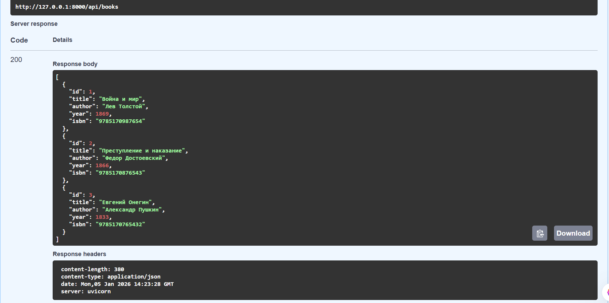
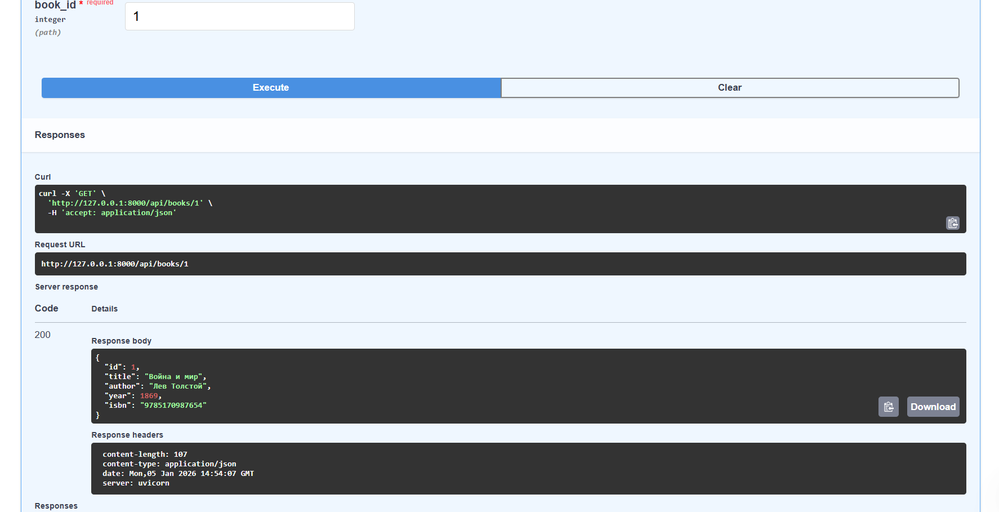

# Лабораторная работа по RestAPI
Выполнила Васильева Е.Д. ИВТ 4 курс, 06.01.2025
## Описание разработанного API
Разработан RESTful API для управления библиотекой книг со следующими возможностями:
* CRUD операции для книг
* Фильтрация по автору и году издания
* Пагинация результатов
* Поиск по ключевым словам
* Статистика по книгам
* Валидация входных данных
* Обработка ошибок с соответствующими HTTP кодами

### Технологический стек:
Python 3.9+
FastAPI 0.104.1
SQLAlchemy 2.0.23
SQLite 3
Pydantic 2.5.0
Uvicorn (ASGI сервер)

## Скриншоты Swagger UI
Скриншот 1:  Получение списка книг

Скриншот 2: Получение книги по ID

Скриншот 3: Эндпоинт POST /api/books


## Фрагменты кода с пояснениями
Код 1: Модель Pydantic для валидации
```python
from pydantic import BaseModel, Field
from datetime import datetime

class BookBase(BaseModel):
    title: str = Field(..., min_length=1, max_length=200, 
                      description="Название книги")
    author: str = Field(..., min_length=1, max_length=100, 
                       description="Автор книги")
    year: int = Field(..., ge=1000, le=datetime.now().year, 
                     description="Год издания")
    isbn: Optional[str] = Field(None, min_length=10, max_length=13, 
                               description="ISBN книги")
```
Дання модель определяет структуру данных книги с валидацией:
* Field(..., min_length=1) 
* ge=1000, le=datetime.now().year — год между 1000 и текущим
* Автоматически генерируется JSON Schema для OpenAPI

Код 2: Эндпоинт для получения книг с фильтрацией
```python
@router.get("/", response_model=List[Book])
async def get_books(
    skip: int = 0,                    # Пагинация: пропустить N записей
    limit: int = 100,                 # Пагинация: ограничить количество
    author: Optional[str] = None,     # Фильтр по автору
    year_from: Optional[int] = None,  # Фильтр: минимальный год
    year_to: Optional[int] = None,    # Фильтр: максимальный год
    db: Session = Depends(get_db)     # Зависимость от БД
):
    query = db.query(BookDB)
    
    if author:
        query = query.filter(BookDB.author.ilike(f"%{author}%"))
    if year_from:
        query = query.filter(BookDB.year >= year_from)
    if year_to:
        query = query.filter(BookDB.year <= year_to)
    
    return query.offset(skip).limit(limit).all()
```
Эндпоинт поддерживает:
* Пагинацию через параметры skip и limit
* Фильтрацию по автору (регистронезависимый поиск)
* Фильтрацию по диапазону годов
* Автоматическую сериализацию в JSON через response_model

Код 3: Обработка ошибок
```python
@router.get("/{book_id}", response_model=Book)
async def get_book(book_id: int, db: Session = Depends(get_db)):
    book = db.query(BookDB).filter(BookDB.id == book_id).first()
    if not book:
        raise HTTPException(
            status_code=status.HTTP_404_NOT_FOUND,
            detail=f"Книга с ID {book_id} не найдена"
        )
    return book
```
При отсутствии книги возвращается HTTP 404 с сообщением

## Дополнительно реализованные книги
Статистика по книгам:
```python
# GET /api/books/stats/statistics - Статистика по книгам
@router.get("/stats/statistics", response_model=StatisticsResponse, tags=["Statistics"])
async def get_statistics(db: Session = Depends(get_db)):
    """
    Получить статистику по книгам.
    
    Возвращает:
    - Общее количество книг
    - Распределение по авторам
    - Распределение по векам
    """
    books = db.query(BookDB).all()
    
    if not books:
        return {
            "total_books": 0,
            "books_by_author": {},
            "books_by_century": {}
        }
    
    total_books = len(books)
    authors = Counter(book.author for book in books)
    centuries = Counter(book.year // 100 + 1 for book in books)
    
    return {
        "total_books": total_books,
        "books_by_author": dict(authors),
        "books_by_century": {f"{century} век": count for century, count in centuries.items()}
    }
```
Поиск по ключевому слову
```python
@router.get("/search/{keyword}", response_model=List[Book])
async def search_books(keyword: str, db: Session = Depends(get_db)):
    """
    Поиск книг по ключевому слову.

    Параметры:
    - **keyword**: Ключевое слово для поиска

    Ищет ключевое слово в названии и авторе книги.
    Возвращает список найденных книг.
    """
    books = db.query(BookDB).filter(
        (BookDB.title.ilike(f"%{keyword}%")) |
        (BookDB.author.ilike(f"%{keyword}%"))
    ).all()

    return books
```
Частичное обновление (PATCH)
```python
@router.patch("/{book_id}", response_model=Book)
async def partial_update_book(
        book_id: int,
        book_update: BookUpdate,
        db: Session = Depends(get_db)
):
    """
    Частично обновить информацию о книге.

    Параметры:
    - **book_id**: ID книги для обновления
    - **book_update**: Данные для обновления (только указанные поля будут изменены)

    Обновляет только те поля, которые были переданы в запросе.
    Если книга не найдена, возвращается ошибка 404.
    """
    db_book = db.query(BookDB).filter(BookDB.id == book_id).first()
    if not db_book:
        raise HTTPException(
            status_code=status.HTTP_404_NOT_FOUND,
            detail=f"Книга с ID {book_id} не найдена"
        )

    # Получаем только переданные поля (исключаем None)
    update_data = book_update.model_dump(exclude_unset=True)

    # Проверяем ISBN, если он изменен
    if 'isbn' in update_data and update_data['isbn'] != db_book.isbn:
        existing_book = db.query(BookDB).filter(
            BookDB.isbn == update_data['isbn'],
            BookDB.id != book_id
        ).first()
        if existing_book:
            raise HTTPException(
                status_code=status.HTTP_400_BAD_REQUEST,
                detail=f"Книга с ISBN {update_data['isbn']} уже существует"
            )

    # Обновляем только переданные поля
    for field, value in update_data.items():
        setattr(db_book, field, value)

    db.commit()
    db.refresh(db_book)
    return db_book
```

## Результаты тестирования
Тест 1: Получение всех книг


Тест 2: Фильтрация по автору


Тест 3: Создание новой книги


Тест 4: PUT


Тест 5: Частичное обновление книги PATCH


Тест 5: Удаление книги по id


Тест 6: Получение статистики


Тест 7: Поиск по ключевому слову


## Контрольные вопросы  
1. Что такое REST и какие шесть принципов лежат в его основе?
REST— архитектурный стиль для веб-сервисов, использующий стандартные HTTP методы. 
- Единообразный интерфейс - стандартные методы HTTP, URI для ресурсов 
- Stateless - каждый запрос независим 
- Кэширование - ответы могут кэшироваться
- Клиент-серверная архитектура*- разделение ответственности
- Слоистая система - промежуточные серверы 

2. В чем разница между методами PUT и PATCH?

* PUT - полная замена ресурса (все поля обязательны)
* PATCH - частичное обновление ресурса (только измененные поля)

3. Что означает идемпотентность HTTP метода?

* Идемпотентность - свойство, при котором многократное выполнение операции дает тот же результат, что и однократное.
* Идемпотентные методы: GET, PUT, DELETE, HEAD, OPTIONS
* Неидемпотентные: POST, PATCH 

4. Какие коды состояния HTTP используются для обозначения операций?

* Успешные:
- 200 OK - успешный запрос
- 201 Created - ресурс создан
- 204 No Content - успешно, нет содержимого

* Ошибки клиента:
- 400 Bad Request - неверный запрос
- 401 Unauthorized - не авторизован
- 403 Forbidden - доступ запрещен
- 404 Not Found - ресурс не найден
- 422 Unprocessable Entity - ошибка валидации

* Ошибки сервера:**
- 500 Internal Server Error - общая ошибка сервера
- 502 Bad Gateway - ошибка прокси
- 503 Service Unavailable - сервис недоступен

5. Что такое OpenAPI Specification и для чего она используется?

* OpenAPI - стандарт для описания REST API в формате YAML/JSON.

**Используется для:**
- Автоматической генерации документации
- Создания клиентских SDK
- Тестирования API
- Валидации запросов

6. В чем разница между OpenAPI и Swagger?

* OpenAPI - спецификация 
* Swagger - набор инструментов для работы с OpenAPI:
- Swagger UI - интерактивная документация
- Swagger Editor - редактор спецификаций
- Swagger Codegen - генерация кода

7. Какие преимущества дает использование FastAPI для разработки REST API?

1. Высокая производительность(асинхронность, на основе Starlette)
2. Автоматическая документация OpenAPI
3. Встроенная валидация через Pydantic
4. Type hints- проверка типов при разработке
5. Простота использования - минимальный код
6. Поддержка WebSocket, GraphQL

8. Что такое Pydantic и как он используется в FastAPI?

* Pydantic - библиотека для валидации данных и парсинга через аннотации типов.
В FastAPI используется для:
- Валидации входных данных запросов
- Сериализации ответов в JSON
- Генерации схемы OpenAPI
- Определения моделей данных

9. Как FastAPI автоматически генерирует документацию API?

1. Извлекает информацию** из декораторов (`@app.get`, `@app.post`)
2. Анализирует аннотации типов параметров функций
3. Использует Pydantic модели для схем данных
4. Генерирует JSON схему OpenAPI
5. Предоставляет UI: `/docs` (Swagger) и `/redoc`

10. Что такое валидация данных и почему она важна в REST API?**
Валидация - проверка корректности входных данных.
- Безопасность (защита от инъекций)
- Целостность данных (правильные типы, форматы)
- Удобство использования (четкие сообщения об ошибках)
- Предотвращение ошибок на раннем этапе

11.Объясните принцип stateless (отсутствие состояния) в REST API.
Stateless - сервер не хранит состояние клиента между запросами.

Как работает:
- Каждый запрос содержит всю необходимую информацию
- Аутентификация через токены в каждом запросе
- Сессии хранятся на клиенте (куки, localStorage)
Преимущества: масштабируемость, простота, надежность.

*12. Какие компоненты входят в структуру OpenAPI документа?

1. Info- метаданные API (название, версия, описание)
2. Paths** - эндпоинты и операции
3. Components** - схемы, параметры, ответы, примеры
4. Servers - URL серверов
5. Security - схемы аутентификации
6. Tags - группировка операций
7. External Docs - ссылки на документацию

13. Как реализуется обработка ошибок в FastAPI?

1. HTTPException для возврата ошибок с кодами состояния:
```python
raise HTTPException(status_code=404, detail="Книга не найдена")
```

2. Валидация Pydantic возвращает 422 при ошибках данных

3. Custom Exception Handlers:
```python
@app.exception_handler(ValidationError)
async def validation_exception_handler(...):
    return JSONResponse(status_code=422, ...)
```

14. Что такое HATEOAS и как этот принцип применяется в REST API?

HATEOAS (Hypermedia as the Engine of Application State) - клиент взаимодействует с API через гипермедиа (ссылки), предоставляемые сервером.

15. Какие методы аутентификации можно использовать в REST API?

1. Basic Auth- логин/пароль в заголовке (не безопасно без HTTPS)
2. Bearer Token (JWT) - токен в заголовке Authorization
3. API Keys - ключ в заголовке или параметре запроса
4. OAuth 2.0 - делегирование доступа через токены
5. Cookies/Sessions - для веб-приложений

## Выводы
* Что было изучено
Принципы RESTful API: освоены основные концепции архитектуры REST
Работа с FastAPI: изучены возможности современного Python фреймворка
Валидация данных: применение Pydantic для проверки входных данных
Работа с БД: интеграция SQLAlchemy с FastAPI
Документация API: автоматическая генерация OpenAPI спецификации
Тестирование API: использование Swagger UI для интерактивного тестирования

* Приобретенные навыки
Разработка REST API с поддержкой всех CRUD операций
Создание валидационных моделей с помощью Pydantic
Работа с базами данных через SQLAlchemy ORM
Реализация фильтрации и пагинации в API
Обработка ошибок с соответствующими HTTP кодами
Тестирование API через Swagger UI и автоматические тесты
Документирование API с использованием OpenAPI
